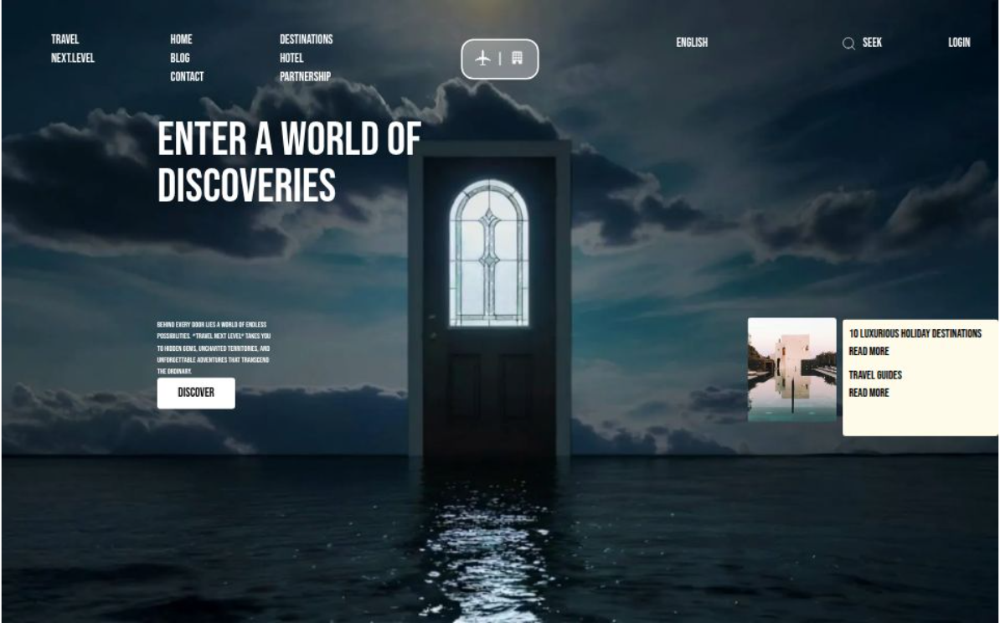

# 🧭 Travelvia - Modern Travel Website (React + Tailwind CSS)

## 🚀 Overview
<a href="https://travelvia-chi.vercel.app/" target="_blank">
  
</a>

**Travelvia** is a **modern, interactive travel website** that brings destinations to life through stunning visuals, scroll-triggered animations, and an elegant design powered by **React**, **Tailwind CSS**, and **GSAP**.  
Built to inspire exploration, it offers smooth transitions, cinematic effects, and a seamless user experience.

---

## 🌟 Features

- 🎬 **Scroll-Based Video Animation** — Immersive hero section with video playback responding to scroll.  
- 🏝️ **Beautiful Destinations** — Showcases hidden gems, exotic places, and adventure getaways.  
- ✈️ **Smooth Navigation** — Intuitive layout and smooth page transitions for perfect user experience.  
- 📰 **Travel Blogs** — Engaging content highlighting adventures, safaris, and luxurious getaways.  
- 💬 **Newsletter Integration** — Join via WhatsApp for exclusive travel updates.  
- 📱 **Fully Responsive** — Optimized for desktop, tablet, and mobile.  
- 🎨 **UI from [Uiverse.io](https://uiverse.io/)** — Beautiful button designs and micro-interactions.  

---

## 🛠️ Tech Stack

- ⚛️ **React.js** – Frontend framework for dynamic UI  
- 🎨 **Tailwind CSS** – Utility-first CSS for styling  
- 🎞️ **GSAP / ScrollTrigger** – For smooth animations and scroll-based effects  
- 💻 **HTML5 & CSS3** – Core structure and styling  
- 🧠 **JavaScript (ES6+)** – Logic and interactivity  
- 🪄 **Uiverse.io** – UI components for creative buttons & animations  

---

## 📚 What You'll Learn

- Implementing scroll-triggered animations using **GSAP**  
- Building responsive layouts with **Tailwind CSS**  
- Structuring a modern React-based travel website  
- Using reusable components and clean UI/UX design  
- Deploying projects on **Vercel**  

---

## 🧩 Use Cases

- 🌍 Travel Agency website  
- 🧳 Tourism business or blog  
- 🎞️ Animated landing pages  
- 🧑‍💻 Frontend animation showcase project  

---

## 📁 Project Structure

/public/ # Static assets (images, videos, icons)
src/
├── assets/ # Images, videos, and icons
├── components/ # Reusable UI components
├── pages/ # App pages (Home, Blog, Destinations, etc.)
├── App.jsx # Main React component
├── main.jsx # Entry point
├── styles/ # Tailwind and custom styles
package.json # Dependencies and scripts
tailwind.config.js # Tailwind configuration
vite.config.js # Vite setup

---

## ⚙️ Installation & Setup

To run this project locally:

```bash
# Clone the repository
git clone https://github.com/AjaykumarBLUEWHALE/travelvia.git

# Navigate to project folder
cd travelvia

# Install dependencies
npm install

# Start the development server
npm run dev
Then open 👉 http://localhost:5173
👨‍💻 Developer

Ajay Kumar
✨ Frontend Developer | React | Tailwind CSS | UI/UX


<a href="https://travelvia-chi.vercel.app/" target='_blank'>🌐 Live Website</a>

